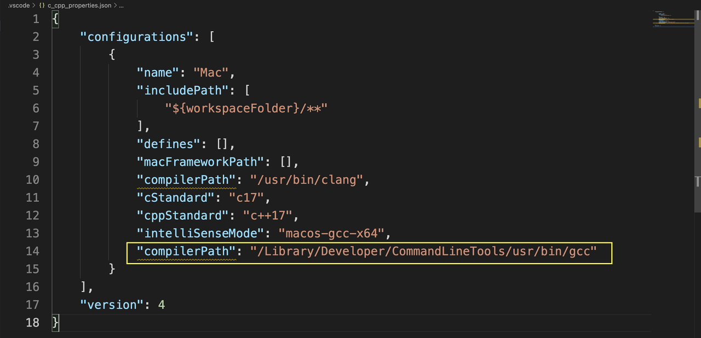

#1 콘솔에 이렇게 뜨면 
xcrun: error: invalid active developer path (/Library/Developer/CommandLineTools), missing xcrun at: /Library/Developer/CommandLineTools/usr/bin/xcrun

 

터미널에 

$ xcode-select --install  입력 후 알아서 설치 후 해결완료

 

#2. #include 오류가 검색되었습니다. includePath를 업데이트하세요. 
gcc는 c언어의 컴파일러

g++은 c++컴파일러 

맥북에서 컴파일러의 경로를 찾지 못해서 발생하는 오류이며 수동으로 설정해줘야한다

 

1.먼저, 컴파일러의 위치를 찾아야한다. 터미널을 열고 gcc --version  치면 컴파일러 위치가 나옴.

 

2.installDir 에 나오는 컴파일러 설치 경로를 C/C++ Extension의 CompilerPath에 붙여줌.

3.command + p 누르고 c_cpp_properties.json 파일을 수정. compilerPath에 경로/gcc 붙여준다.

//

<C언어의 정석>

1.1 변수란?
단 하나의 값을 저장할 수 있는 메모리 공간

 

1.2 변수의 선언과 초기화
변수타입 변수이름;

int age;
변수타입 변수이름;
변수를 선언한 이후에는 변수 사용할 수 있으나 , 그 전에 반드시 변수 '초기화(initialization)' 해야함.

int age;
age=25;

#변수 선언과 초기화 한 번에 하기
int age=30;

#변수 타입 같은 경우 콤마를 구분자로 여러 변수를 한 줄에 선언 및 초기화
int age=30, height=5;
 

*주의사항. 어떤 컴파일러에서는 선언문이 일반문보다 앞에 오지 않으면 에러발생하는 경우가 있음, 최근은 잘 없음

int age;    //선언문
age=25;     //일반문, 에러발생
int grade;  //선언문

int age;    //선언문
int grade;  //선언문
age=25;     //일반문, 가능
 

1.3 변수의 명명규칙
① 알파벳(A~Z, a~z), 숫자(0~9), 밑줄( _ )만 포함될 수 있다.

② 대소문자가 구별된다.

③ 숫자로 시작해서는 안 된다.

④ 예약어를 사용해서는 안된다.

 1.4 자료형(data tupe)
기본형(basic type)

|분류|타입|
|---|---|
|문자형|char 문자를 저장하는데 사용, 변수당 하나의 문자만 저장할 수 있다.|
|정수형|	short, int, long, long long 정수를 저장하는데 사용되며, 주로  int가 사용된다.|
|실수형	float, doulbe, long double 실수를 저장하는데 사용되며, 주로 double이 사용된다.|

파생형(derived type)
|종류|설명|
|배열(array)|같은 타입의 여러 변수를 하나로 묶은 타입|
|구조체(structure)|다른 타입의 여러 변수를 하나로 묶은 타입|
|공용체(union)|다른 타입의 여러 변수가 하나의 저장공간을 공유하는 타입|
|포인터(pointer)|메모리 주소를 저장하기 위한 타입|
|함수(function)|함수를 선언하기 위한 타입|
 

 

1.5 기본형(basic type)
1.6 상수와 리터럴(constant & literal)
 

변수(variable) : 하나의 값을 저장하기 위한 공간

상수(constant): 한번만 값을 저장할 수 있는 공간

리터럴(literal) : 그 자체로 값을 의미하는 값

 

 

상수는 변수와 마찬가지로 '값을 저장할 수 있는 공간'이지만, 변수와 달리 한번 값을 저장하면 다른 값으로 변경 불가
const int MAX_SPEED =100; // 상수 MAX_SPEED 선언

const int MAX_SPEED;      // 에러. 상수는 선언과 동시에 초기화해야함

MAX_SPEED=200;            // 에러.상수의 값은 변경될 수 없음.

int year = 2014;          // year : 변수, 2014 : 리터럴
const int MAX_VALUE =100; // MAX_VALUE : 상수, 100 : 리터럴
#define 을 이용한 상수정의
#define 상수이름 리터럴

#define WIDTH 20

//#include 와 #define 처럼 #으로 시작하는 라인은 C언어의 문장이 아니라 '전처리기 지시자'(preprocessor directive)
//따라서 세미콜론(;) 을 붙이지 않는다.
전처리(preprocessing) : 컴파일 직전에 소스코드에 가하는 작업

전처리기(preprocessor) : 전처리를 하는 프로그램(컴파일러에 포함)

전처리기 지시자(preprocessor directive) : 전처리 명령어(#으로 시작하는 라인)

 

리터럴의 타입
확장열(escape sequence)
제어문자	확장열	아스키코드
널 문자	\0	0
경고(bell)	\a	7
백스페이스(backspace)	\b	8
수평탭(horizontal tab)	\t	9
줄바꿈(new line)	\n	10
수직탭(vertical tab)	\v	11
폼피트(form feed)	\f	12
캐리지 리턴(carriage return)	\r	13
큰 따옴표	\"	34
작은 따옴표	\'	39
역슬래시(back slash)	\\	92